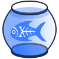

# Project and other icons

In this folder a library of SVGs and (derived) Windows .ico files offers users a choice of simple graphical images to use as icons, for example to represent processes and resources in your file system.

At user discretion, any of these could be associated with a script or a file type.

For example, on Windows it is straightfoward to create a shortcut for a process script such as [../xp3.bat](../xp3.bat), copy the shortcut to any convenient location, and change its icon to provide a visual association for the operation. The process can be invoked by double-clicking on it or (in the case of processes that expect runtime arguments) by dragging a resource to it. 

In an effort to support [XProc 3.0](https://xproc.org) branding and awareness efforts, these images embed Kanava, the piscine [XProc mascot](https://xproc.org/img/logo.png), with the kind permission of the author.

Like everything on this site, these productions are placed in the public domain, with [no warranty](../LICENSE.md), only the hope they may be useful. Please reuse, alter and appropriate as you see fit, giving credit for originals.

