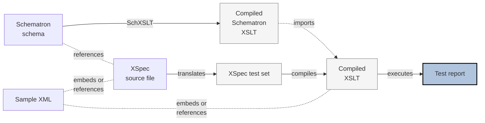

# Schematron XSpec under XProc 3.0

XSpec testing Schematron is a bit more complicated than testing XSLT, in part because Schematron itself is not a simple transformation, but rather the application by means of transformation of a set of rules - a transformation on top of a transformation.

Additionally, at this date we have no XProc 3.0 implementation of XSpec (to my knowledge) - this is fresh ground.

## Schematron XSpec Execution Workflow

The current workflow is implemented in Ant or using shell-script (batch file) logic, and looks like this. This works well and is expected to be stable:

The flowchart diagram below was made based on inputs provided by @galtm - thanks!

[Edit here](https://mermaid.live/edit#pako:eNqdkz1z4jAQhv-KRzViEn8ctgqay6UiTZyCOUQh7AVrIkseSZ7AAf_9VraHgVx3bry7evfRu7Z0JpWpgTBysKJrotU711xXSjj3AvtIag9WttFeKsW-GunBteYTZs5bfLGDhdOd2vS-6_0oVvLQeOcB1E71t4adEtXnlNAvWfuGxWFDC52xfvMBzkdjvGWMjTyOHpyX-rAuVx-bn6btpIKacx3yIJtMcu2qZlNWDbQCN9B8KGCyHYLv3Q_Cf1BH10H1itLNusQosExvKwjDAQKrCTSsjpoo2Iwc-EdPou0UrN9Wm3KIIgy3YeS7oSJK4QhVjyVKl9MHuJmmc7q8yDbU3OWu65sJhEz5AHkQIonScsLR5QS-mxKbvRXaKTF5eECPgDm9WNiDBV2Bu9xa70YMEmh3ULvIWB7-6v_KH9xH-HBNZqQF2wpZ42E9hyonHn8hcMIwrGEveuU54fqK0r6rcZRftfTGErYXysGMiN6b8qQrwrzFMzmJXqTAs9_eVJ3QhJ3JkbBFMi_SRVoUaZoUeZ5lM3IiLMvmcbJI4iJLs_jpOU2uM_LHGAQ8zReLOHnO0zxGfZH_yAfa72Fx3BIGR2_jlRtu3vUvoy1B1Q)

### XProc implementation

In the 'classic' architecture depicted, the ready-to-go XSLT imports a ready-to-go XSLT as if it were a compiled XSpec XSLT importing a target XSLT. In this case, however, this compiled XSLT does not exist until the processor has a change to compile the Schematron - against its own target XSLT - to produce it. This makes it difficult to import.

We address this with a post-process executed over the XSLT that replaces the import instruction with the templates to be imported.

Closer examination and testing can help to determine if this approach is hazardous - and how to mitigate it if it is. For example, use of `xsl:apply-imports` might have to be adapted.

This (analysis and implementation) can all be done as XProc operations without affecting 'mother code' - learn as we go.
