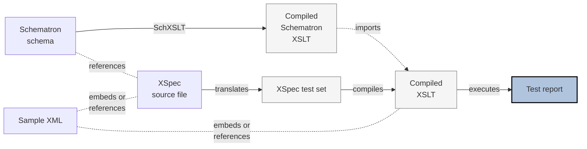

# Schematron XSpec under XProc 3.0

XSpec testing Schematron is a bit more complicated than testing XSLT, because Schematron itself is not a simple transformation. By means of a transformation, a set of rules is applied to a document or XML fragment (for testing), with that transformation (Compiled Schematron XSLT) being produced by a transformation (the Schematron compiler - SchXSLT here).

## Schematron XSpec Execution Workflow

The current workflow is implemented in Ant or using shell-script (batch file) logic, and looks like this. This works well and is expected to be stable:

The flowchart diagram below was made based on inputs provided by @galtm - thanks!

[Edit here](https://mermaid.live/edit#pako:eNqdkz1z4jAQhv-KRzViEn8ctgqay6UiTZyCOUQh7AVrIkseSZ7AAf_9VraHgVx3bry7evfRu7Z0JpWpgTBysKJrotU711xXSjj3AvtIag9WttFeKsW-GunBteYTZs5bfLGDhdOd2vS-6_0oVvLQeOcB1E71t4adEtXnlNAvWfuGxWFDC52xfvMBzkdjvGWMjTyOHpyX-rAuVx-bn6btpIKacx3yIJtMcu2qZlNWDbQCN9B8KGCyHYLv3Q_Cf1BH10H1itLNusQosExvKwjDAQKrCTSsjpoo2Iwc-EdPou0UrN9Wm3KIIgy3YeS7oSJK4QhVjyVKl9MHuJmmc7q8yDbU3OWu65sJhEz5AHkQIonScsLR5QS-mxKbvRXaKTF5eECPgDm9WNiDBV2Bu9xa70YMEmh3ULvIWB7-6v_KH9xH-HBNZqQF2wpZ42E9hyonHn8hcMIwrGEveuU54fqK0r6rcZRftfTGErYXysGMiN6b8qQrwrzFMzmJXqTAs9_eVJ3QhJ3JkbBFMi_SRVoUaZoUeZ5lM3IiLMvmcbJI4iJLs_jpOU2uM_LHGAQ8zReLOHnO0zxGfZH_yAfa72Fx3BIGR2_jlRtu3vUvoy1B1Q)

## XProc implementation

As depicted, a ready-to-go XSLT (**Compiled XSLT**) imports a ready-to-go XSLT (**Compiled Schematron XSLT** produced using the commodity tool) as if it were a compiled XSpec XSLT importing a target XSLT. In the usual case this is the XSLT under test -- and indeed ordinarily we would run the Schematron by producing and running it. In this case, however, the upstream compiled XSLT does not exist unless the processor compiles the upstream Schematron to produce it. An XSLT that does not exist is difficult to import from another module.

Rather than introduce a file-system or other runtime dependency into XProc - which would 'prefer' to be entirely side-effect-free - the pipeline here modifies the (compiled) XSLT on the fly, replacing its `xsl:import` instruction with the literal templates to be imported. 

Closer examination and testing can help to determine if this approach is fragile, and how to mitigate it if it is.

## Potential shortfalls

For example, if `xsl:apply-imports` ever appears in the generated code (Schematron as compiled into XSLT), it would presumably require rewriting because no longer functional.

Similarly, Schematrons that rely on complex XSLT especially when it is modular (`xsl:include`, `xsl:import`) -- these remain to be tried and YMMV.

The hope going forward is that this work (trying and testing, analysis and implementation) can all be done -- with XProc -- without affecting 'mother code' -- learn as we go.
